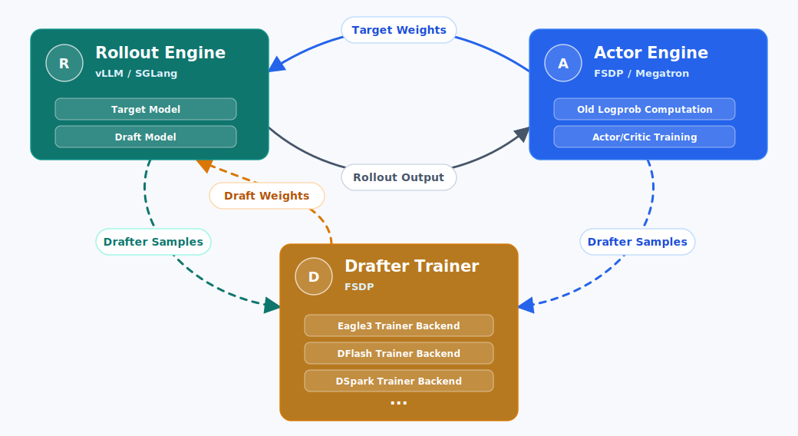

# verl-SpeCo: Co-Train to Accelerate RL and Inference

`verl-SpeCo` is a lightweight SPECO drafter-training overlay for
[verl](https://github.com/verl-project/verl). It keeps upstream `verl` as an
import-only dependency and adds speculative decoding drafter collection,
training, and hot-update logic through `verl_speco`.

## Highlights

- **Import-only verl overlay**: composes upstream `verl` PPO/GRPO config and
  runs through `python -m verl_speco.main` without patching the installed `verl`
  tree.
- **Drafter Co-Training in the RL loop**: collects hidden states during    rollout or
  old-logprob computation, trains a drafter periodically, and publishes updated
  drafter weights back to the rollout engine.
- **Multiple drafter backends**: includes EAGLE3, DFLASH, and DSpark trainer
  backends under `verl_speco.backends`.
- **vLLM and SGLang integration**: supports EAGLE3, DFLASH, and DSpark
  speculative decoding on vLLM, plus EAGLE3 and DFLASH on SGLang, with
  drafter collection and hot-update logic integrated through the rollout
  engine.
- **GPU and NPU examples**: provides example scripts for vLLM, SGLang, and
  vLLM-Ascend style graph settings.
- **Step-level observability**: exposes drafter timing and vLLM speculative
  decoding acceptance metrics, including
  `drafter/spec_decode/mean_acceptance_length`.

## Architecture



## Performance Preview

The current results focus on EAGLE3 with the vLLM rollout engine, where
verl-SpeCo supports both GPU and NPU deployments. The figures below show a
Qwen3-8B EAGLE3 run on vLLM-Ascend/NPU; DFLASH support is available, and DFLASH
figures will be added in a later update.

On Qwen3-8B with an EAGLE3 drafter on vLLM-Ascend/NPU, a 100-step run shows
that co-training increases mean acceptance length over the fixed-drafter setting
and, compared with the baseline, delivers about 20% faster rollout and 11%
faster end-to-end training without accuracy regression.

| Mean Acceptance Length | Generation Time |
| --- | --- |
|  |  |

| Step Time | Critic Reward |
| --- | --- |
|  |  |

## Draft Model Support

| Draft model | Rollout engines | Training engines | Status |
| :---: | :---: | :---: | :---: |
| EAGLE3 | vLLM, SGLang | FSDP | ✅ |
| DFLASH | vLLM, SGLang | FSDP | ✅ |
| DSpark | vLLM | FSDP | ✅ |

## Runtime Compatibility

The runtime requirements are backend-specific. `REQUIRED_VERL.txt` only pins
the upstream `verl` version; install the matching rollout runtime for the
drafter backend you use.

| Draft model | vLLM | vLLM-Ascend | SGLang |
| :---: | :---: | :---: | :---: |
| EAGLE3 | &gt;= 0.18.0 | &gt;= 0.18.0 | &gt;= 0.5.10 |
| DFLASH | &gt;= 0.20.2 | &gt;= 0.20.2 | &gt;= 0.5.12 |
| DSpark | GPU: [main](https://github.com/vllm-project/vllm/tree/main)<br>NPU: [`dc68bd8`](https://github.com/vllm-project/vllm/tree/dc68bd8c4199b00631fe71eb37313f406cc66ac1) | NPU: [`8214d19`](https://github.com/vllm-project/vllm-ascend/tree/8214d19f8b505484b839469444887b404db2e3a8) | - |

For vLLM DFLASH, the drafter checkpoint must use the DFlash draft model config
expected by the runtime.

For vLLM DSpark on GPU, use vLLM main. For vLLM DSpark on NPU, follow the
version pairing documented by
[vLLM-Ascend PR #11153](https://github.com/vllm-project/vllm-ascend/pull/11153):
vLLM
[`dc68bd8c4199b00631fe71eb37313f406cc66ac1`](https://github.com/vllm-project/vllm/tree/dc68bd8c4199b00631fe71eb37313f406cc66ac1)
and vLLM-Ascend
[`8214d19f8b505484b839469444887b404db2e3a8`](https://github.com/vllm-project/vllm-ascend/tree/8214d19f8b505484b839469444887b404db2e3a8).
SpeCo keeps the user-facing algorithm as `DSPARK`; on vLLM-Ascend/NPU it
follows that PR's DSpark path.

## Repository Layout

```text
verl_speco/
  main.py                         # Hydra entrypoint
  config/speco_base.yaml          # shared SPECO/drafter defaults
  config/speco_trainer.yaml       # online PPO primary config
  config/draft_trainer.yaml       # standalone drafter primary config
  trainer/speco_ray_trainer.py    # RayPPOTrainer adapter
  workers/speco_worker.py         # drafter trainer worker
  integration/                    # vLLM, SGLang, old-logprob, publish adapters
  backends/                       # EAGLE3/DFLASH/DSpark trainer backends
  models/                         # drafter model definitions

examples/                         # end-to-end command examples
tests/                            # CPU-light contract tests
ci/                               # smoke-test helpers and CI notes
```

## Installation

This repository does not currently define its own Python package metadata. Use
it with the upstream `verl` commit pinned in
[`REQUIRED_VERL.txt`](./REQUIRED_VERL.txt), which is mirrored in
[`verl_speco/config/speco_base.yaml`](./verl_speco/config/speco_base.yaml).
By default, unsupported `verl` versions produce a warning. Set
`VERL_SPECO_STRICT_VERL=1` to fail closed when the importable `verl` does not
match the pinned version or commit.

One typical editable setup is:

```bash
git clone https://github.com/verl-project/verl.git
cd verl
git checkout 7aed6b230776f963fa09509c10d9c3a767d1102c
pip install -e .

cd /path/to/verl-SpeCo
export PYTHONPATH="$PWD:$PYTHONPATH"
```

### Docker Images

You can also build GPU runtime images from the official `verlai/verl`
development images and then pin the importable upstream `verl` checkout to the
required v0.8.0 commit. The Dockerfiles below target GPU deployments; use the
matching accelerator image for NPU or other accelerator runtimes.

For GPU vLLM-based examples, use this Dockerfile:

```dockerfile
# GPU vLLM runtime image.
FROM verlai/verl:vllm023.dev1

ARG VERL_COMMIT=7aed6b230776f963fa09509c10d9c3a767d1102c
ARG VERL_REPO=https://github.com/verl-project/verl.git

WORKDIR /workspace

RUN git clone ${VERL_REPO} /workspace/verl \
    && cd /workspace/verl \
    && git checkout ${VERL_COMMIT} \
    && pip install -e .

COPY . /workspace/verl-SpeCo

ENV PYTHONPATH=/workspace/verl-SpeCo:${PYTHONPATH}
WORKDIR /workspace/verl-SpeCo
```

Build it from the `verl-SpeCo` repository root:

```bash
docker build -f Dockerfile.vllm -t verl-speco:vllm023-verl080 .
```

For GPU SGLang-based examples, use the same layout with the SGLang base image:

```dockerfile
# GPU SGLang runtime image.
FROM verlai/verl:sgl0512.dev1

ARG VERL_COMMIT=7aed6b230776f963fa09509c10d9c3a767d1102c
ARG VERL_REPO=https://github.com/verl-project/verl.git

WORKDIR /workspace

RUN git clone ${VERL_REPO} /workspace/verl \
    && cd /workspace/verl \
    && git checkout ${VERL_COMMIT} \
    && pip install -e .

COPY . /workspace/verl-SpeCo

ENV PYTHONPATH=/workspace/verl-SpeCo:${PYTHONPATH}
WORKDIR /workspace/verl-SpeCo
```

Build it from the `verl-SpeCo` repository root:

```bash
docker build -f Dockerfile.sglang -t verl-speco:sgl0512-verl080 .
```

Install the rollout engine and accelerator runtime that match the script you
intend to run, for example vLLM on GPU, SGLang on GPU, or vLLM-Ascend on NPU.
Those runtime packages are intentionally not pinned by this repository.

## Quickstart

Start from one of the example scripts and replace the model, drafter, dataset,
and checkpoint paths:

```bash
bash examples/run_qwen3-8b_drafter_eagle3_vllm.sh
```

For NPU with vLLM-Ascend-style graph settings:

```bash
bash examples/run_qwen3-8b_drafter_eagle3_vllm_npu.sh
```

The vLLM-Ascend examples keep `FULL_DECODE_ONLY` and dense cudagraph capture
sizes in the launch script so graph behavior is explicit.

All examples use the same entrypoint:

```bash
python -m verl_speco.main
```

The main drafter switches are:

```bash
actor_rollout_ref.rollout.drafter.enable=True
actor_rollout_ref.rollout.drafter.enable_drafter_training=True
actor_rollout_ref.rollout.drafter.model_path=/path/to/drafter
actor_rollout_ref.rollout.drafter.speculative_algorithm=EAGLE3
```

## Separate Draft Model Training

verl-SpeCo also supports a separate draft model training workflow. In this
mode, rollout workers collect drafter training features into a feature store,
and the draft model can be trained separately after feature collection.

Quickstart:

```bash
bash examples/run_qwen3-8b_drafter_separate_training.sh
```

Replace the model, drafter, dataset, feature-store, and checkpoint paths in
the script before running it. The script uses `collect_only` mode for rollout
feature collection and `offline` mode for standalone drafter training.

The main mode values are:

| Mode | Meaning |
| --- | --- |
| `online` | Default. Collects rollout features, trains the drafter inside the online PPO/Ray workflow, and can publish updated drafter weights back to the rollout engine. |
| `collect_only` | Collects rollout features into `feature_store.path` without running drafter training in the PPO/Ray workflow. |
| `offline` | Reads collected features from `feature_store.path` and trains the drafter with the standalone multi-GPU workflow. |

Offline training supports every drafter family the online workers support:
EAGLE-1, EAGLE-2, EAGLE-3, DFlash, DSpark, Domino and P-EAGLE.

Domino and P-EAGLE are training-time families with no engine-level speculative
method of their own (engines serve Domino as a DFlash projector sub-mode, and
P-EAGLE needs the parallel-drafting runtime), so the rollout stage collects
features with the engine algorithm whose hidden-state layout they consume, and
the offline stage trains them from that same feature store:

| Drafter to train | Stage 1 `speculative_algorithm` | Feature layout | Stage 2 `speculative_algorithm` |
| --- | --- | --- | --- |
| Domino | `DFLASH` | `dflash_aux` | `DOMINO` |
| P-EAGLE | `EAGLE3` | `eagle3_aux_plus_last` | `PEAGLE` |

```bash
DRAFT_ALGO=domino bash examples/run_qwen3-8b_drafter_domino_peagle_separate_training.sh
DRAFT_ALGO=peagle bash examples/run_qwen3-8b_drafter_domino_peagle_separate_training.sh
```

Feature stores collected with `speculative_algorithm=DOMINO` before Domino was
mapped to the DFlash layout carry `hidden_states_layout=eagle3_aux_plus_last`
in their sample metadata. DFlash preprocessing fails closed on that layout, so
those stores have to be collected again with `DFLASH`.

Collected feature stores can be inspected before offline training:

```bash
python -m verl_speco.inspect_feature_store /path/to/features \
  --max-samples 200 \
  --show-ok \
  --strict-exit
```

## Configuration

SPECO-specific options live under:

```text
actor_rollout_ref.rollout.drafter.*
```

Important groups:

- `drafter.enable`: enables speculative decoding at rollout time.
- `drafter.enable_drafter_training`: enables online drafter trainer workers.
- `drafter.rollout.*`: controls speculative steps, top-k, and verify tokens.
- `drafter.training.*`: controls hidden-state collection, training interval,
  publish interval, update mode, and DFLASH/DSpark-specific training options.
- `drafter.vllm.*`: contains vLLM-specific drafter overrides.

Shared SPECO and drafter defaults are in
[`verl_speco/config/speco_base.yaml`](./verl_speco/config/speco_base.yaml).
The online PPO entrypoint composes them through
[`speco_trainer.yaml`](./verl_speco/config/speco_trainer.yaml), while standalone
feature-store training uses
[`draft_trainer.yaml`](./verl_speco/config/draft_trainer.yaml).

## Testing

CPU-light contract tests can be run with:

```bash
pip install -r ci/requirements-ci.txt
pytest tests
```

Some tests require a pinned upstream `verl` checkout. Set
`VERL_SPECO_UPSTREAM_ROOT` to the root of that checkout when running the config
composition contract:

```bash
export VERL_SPECO_UPSTREAM_ROOT=/path/to/verl
pytest tests/config/test_speco_config_overlay.py
```

Hardware smoke tests are kept under `ci/` and are intended for self-hosted GPU
or NPU runners with matching model paths and runtime packages.

## Community

Scan the QR code below to join the verl-SpeCo Lark user group.

<p align="center">
  
</p>

## Contributing

Keep changes scoped to the overlay whenever possible. If a change requires
upstream `verl` behavior, prefer adding a compatibility adapter in
`verl_speco.integration` and document the supported `verl` version in
`REQUIRED_VERL.txt`.

Before proposing changes upstream or opening a PR, follow the repository rules
in [`AGENTS.md`](./AGENTS.md), including duplicate-work checks and test
reporting.

## Acknowledgements

This project builds on [verl](https://github.com/verl-project/verl),
[vLLM](https://github.com/vllm-project/vllm),
[SGLang](https://github.com/sgl-project/sglang), and
[vLLM-Ascend](https://github.com/vllm-project/vllm-ascend).
